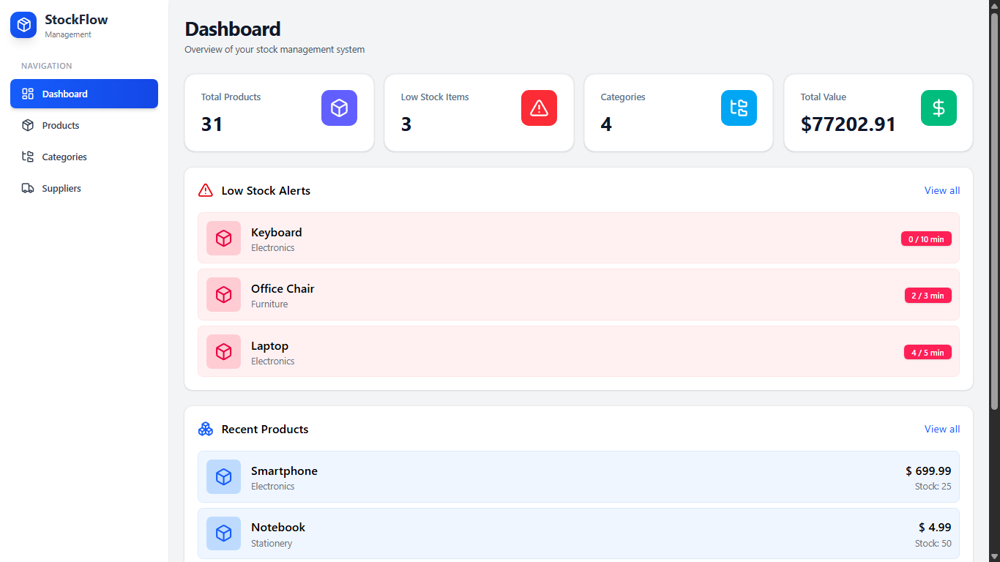
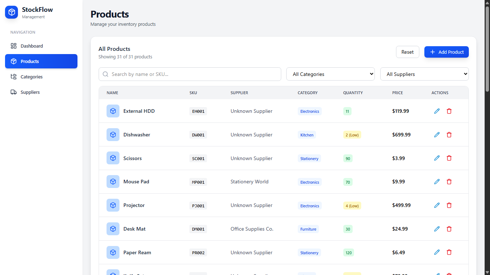
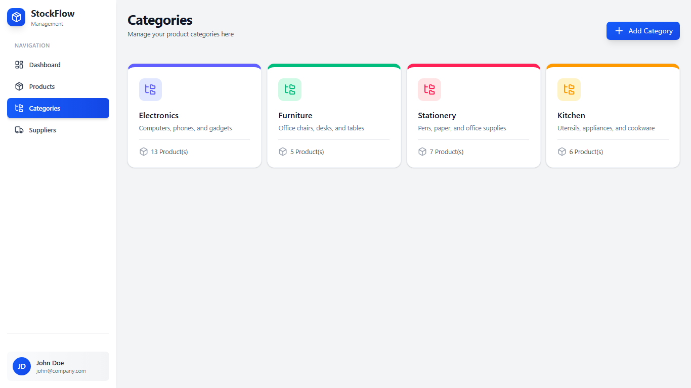
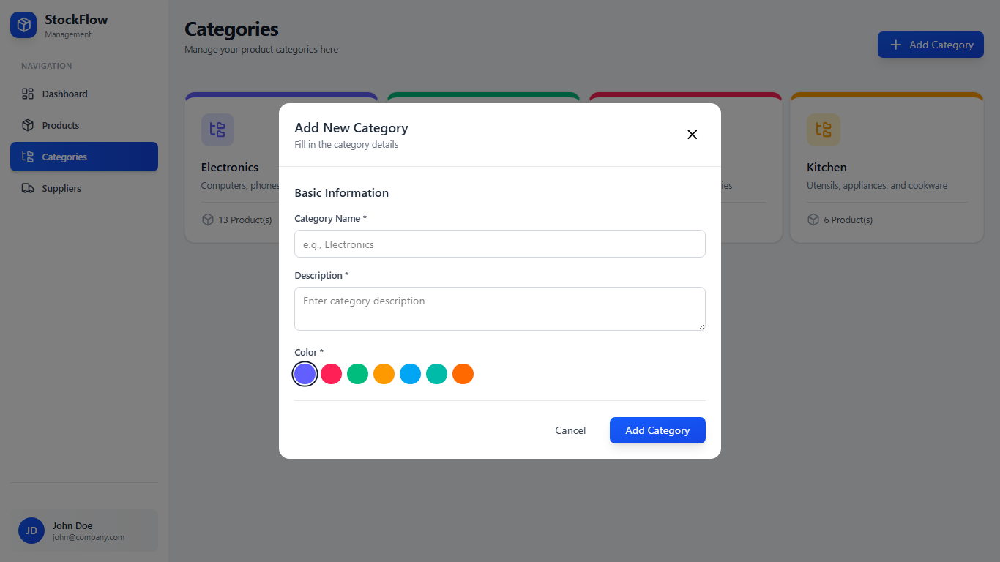
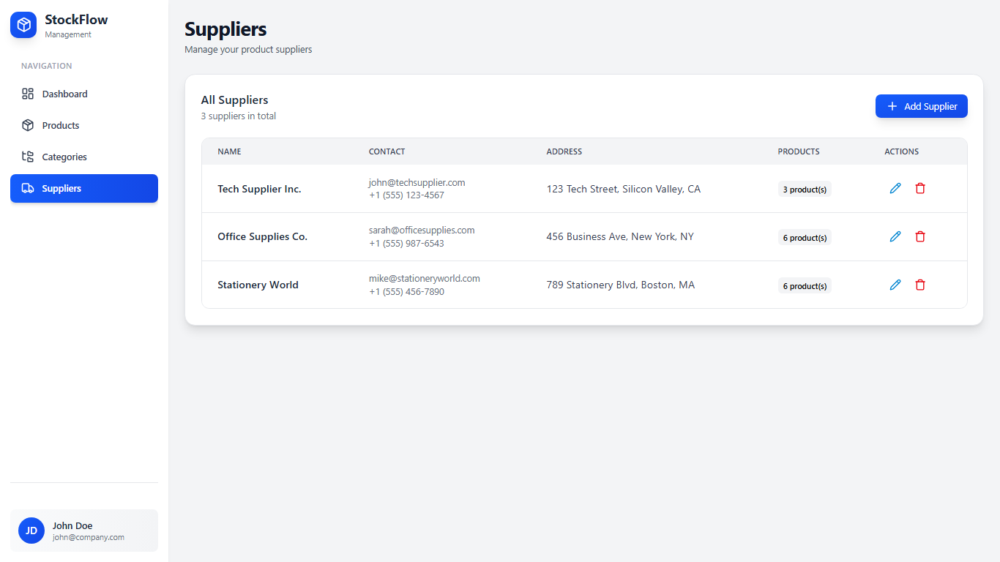

# Gestion-Stock ✅

Gestion-Stock is a small inventory (stock) management frontend built with React and Vite. It includes sample data for categories and products so you can quickly run and explore the app locally.

---

## 🚀 Features

- Simple product and category listing UI
- Sample data included: `frontend/src/data/defaultProducts.json` and `frontend/src/data/defaultCategories.json`
- Built with React, Tailwind and Vite for fast development

---

## 💻 Tech stack

- React 19
- Vite
- TailwindCSS
- ESLint

---

## 🛠️ Setup & Run (local)

1. Ensure you have Node.js (v16+) installed.
2. From the repository root open a terminal and run:

```cmd
cd frontend
npm install
npm run dev
```

3. Open the URL shown by Vite (usually `http://localhost:5173`) in your browser.

---

## 📁 Project structure (important files)

- `frontend/` – React app
	- `src/data/defaultProducts.json` – sample product data (30 items)
	- `src/data/defaultCategories.json` – sample categories
	- `src/data/defaultSuppliers.json` – sample suppliers

---

## 🖼️ Screenshots

Example images:







